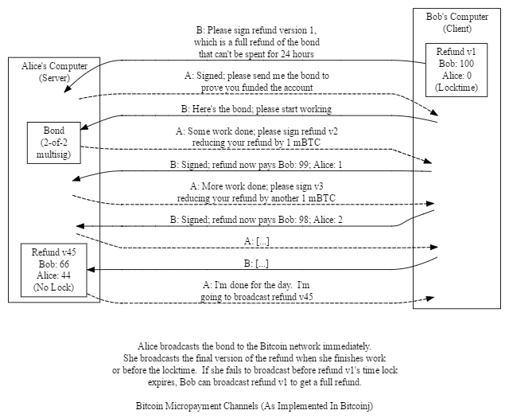

## Pallet 01

Pallet 想要达成一个On-chain的智能合约平台，使虚拟货币使用者可以不受特定区块链的限制，透过一些整合现有的技术以及使用者共同监督的作法，克服现有的问题使得区块链的应用可以更贴近更多的使用情境。

以下的Demo是基于Bitcoin的案例所製作的简介，开始Demo之前让我们讲解一点Bitcoin的基本知识:

##### * Unspent Transaction Output:
在Bitcoin上其实并不存在任何coin的概念，有的是Utxo的架构，区块链上证明谁拥有哪些Utxo, Utxo可以将它视为可以找零的支票，每次花费的时候需要把整张支票拿出去作为Input,交易的Output为如何花费Utxo，哪些需要转出，剩馀的需要转回原有的地址。

##### * Address:
每一个地址都有一笔对应的公钥以及私钥，透过私钥去证明使用者作为该地址的拥有者，透过这个证明使用者才可以花费Utxo.

##### * Bitcoin Contract:
每次交易(Transaction)产生想要去花费Utxo的过程，例如证明私钥的拥有证明，这些都是Bitcoin Script的执行，但是Bitcoin支援的Script并不具有图灵完备性，Pallet透过扩充的方式希望解决这个问题

##### * Multisignature Address
可以透过多把公钥产生一个Bitcoin的地址，如果需要花费这个地址上的Utxo就需要特定数量的私钥去签署交易才可以完成一个合法的私钥

##### * Micropayment Channel
以下说明一个节录自『bitcoin developer guide』的Micropayment Channel案例。

大致的内容是在说明Alice帮Bob工作，Alice希望他在完成一件事情的情况下Bob就需要付钱给她，然而在Bitcoin上发起短期且频繁的交易是昂贵且费时的，Micropayment Channel的案例是透过Multisignature Address去製作多签地址，让Bob先将一笔押金抵押至多签地址中，且製作一个锁定24小时的交易，这个交易的结果是将钱退还给Bob, 当Alice完成工作之后Bob会产生一个可以立即生效的交易给Alice， 每次完成工作就更新一个版本增加要给予Alice的金额，Alice必须在锁定时间结清工作要不然Bob将可以索回所有抵押进去的金额，从这个案例我们可以发现在Bitcoin在实现契约交易是非常複杂且不便利的，这也是Pallet想要解决的问题。

