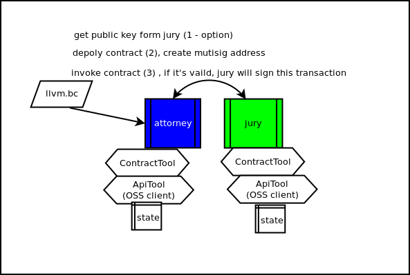
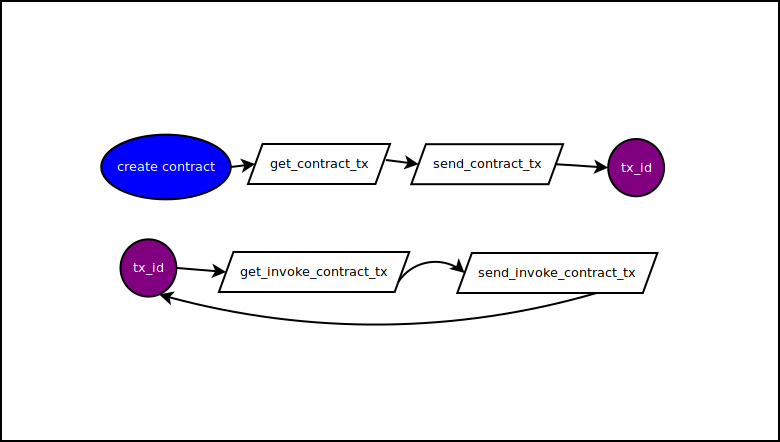

## Pallet 02

本段将进行Pallet的Demo架构解说，本章节偏向较为技术方面的解说:

## 架构图:

### 执行说明
#### 部属合约:
1. 将notary的列表注册加入attorney. attorney会将notary的公钥储存起来. (之后用于产生mutisig address)
2. llvm.bc和contract.h为一组的. llvm.bc透过contract.c产生实际的合约执行档
3. ContractTool为合约的sdk. 透过实行/产生部属执行档工作
4. 使用者在部属contract的时候选定notrary并产生mutisig address
5. Attorney会将使用者部属的条件透过ContractTool先行运行. 如果没有问题会产生Transaction储存结果.
6. ApiTool的部份用于连接沟通区块链的交互工作.
7. 使用者签署attorney产生的Transaction结果. (花费链上的钱 -> 传送给Mutisig Address以及Depoly feed)
8. Attorney将Transaction及llvm.bc传送给Notary. 如果Notary实行都没有出错. Attorney将会depoly这个transaction. 回传Transaction id (tx_id).
9. Attorney代为储存Mutisig Address以及最新的tx_id和相关Notary列表.
10. 挖矿确认完成之后合约即生效

#### 调用合约:
1. 输入Mutisig Address及最新的tx_id, user address, 调用合约的函数, Attorney将在本地执行验证请求.
2. 如果这只是一个查询需求.并不打算更改任何state. Attorney将返回执行结果。
3. Attorney执行完后将会产生对应需要部属的transaction(tx).
4. 使用者对这个tx做sign的动作. 然后透过Attorney将这个tx部属给Notarys.
5. 每一个Notary将会验证结果,如果结果符合将会对这个tx做签署及回传验证交易给Attorney.
6. Attorney蒐集所有Notary的执行结果tx之后尝试部属到链上. 透过区块链去判定这个tx是否合法.
7. 挖矿确认完成之后合约功能执行生效
