## Pallet 03

本段将进行Pallet的Demo情境操作解说：

##### 将Jury注册至Attorney

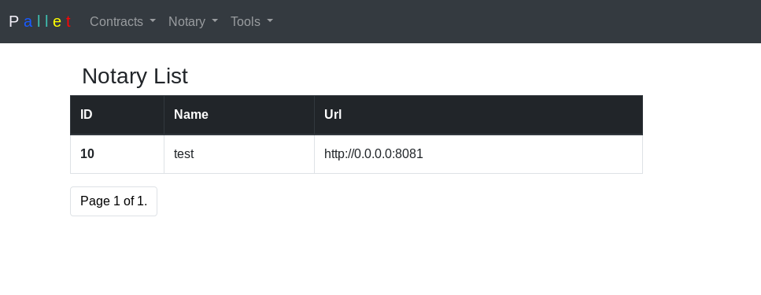

##### 创建合约(Demo1)
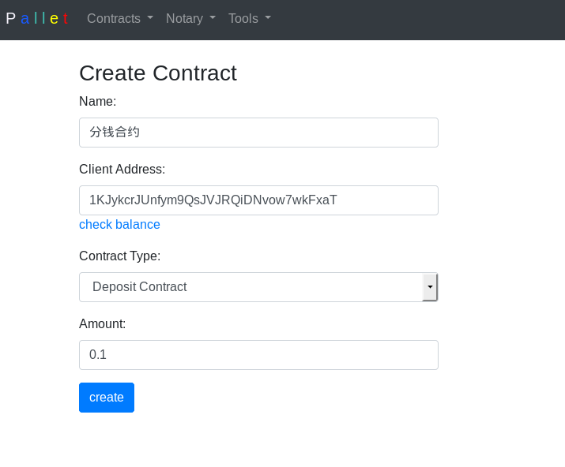

##### 产生多签地址以及合约对应的区块链交易. 部属合约使用者使用私钥签署合约
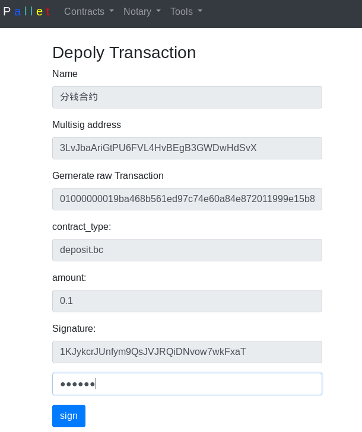

##### 合约部属成功
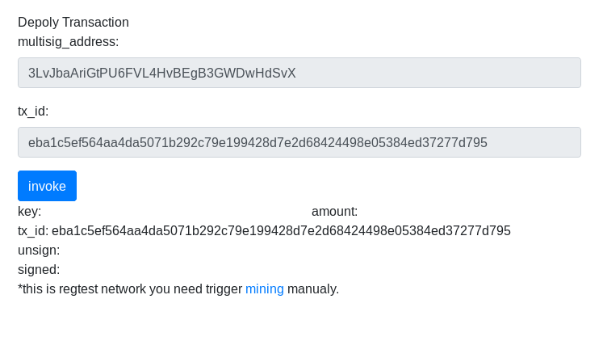

##### 合约功能解说
本合约的功能很简单，使用者可以设定两个可以接收合约裡面押金的地址，透过合约的参数呼叫可以将押金分给给这两个地址
* set_address [A] [B]
* A [amount]
* B [amount]

##### set_address [A] [B] - 准备
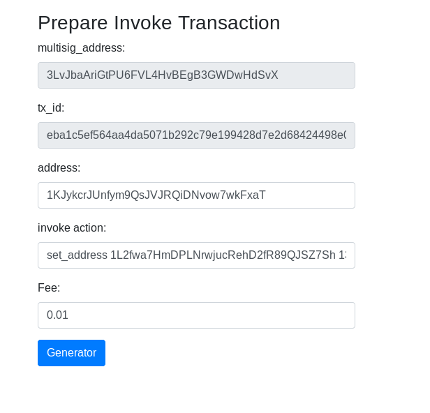

##### set_address [A] [B] - 产生结果(Attorney side)
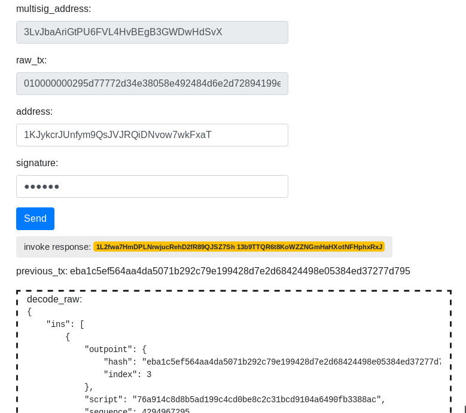

##### set_address [A] [B] - 产生结果(Jury 完成确认)
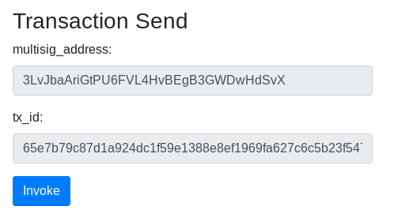

##### 检查A address拥有的Utxo [情境解释与合约执行无关]
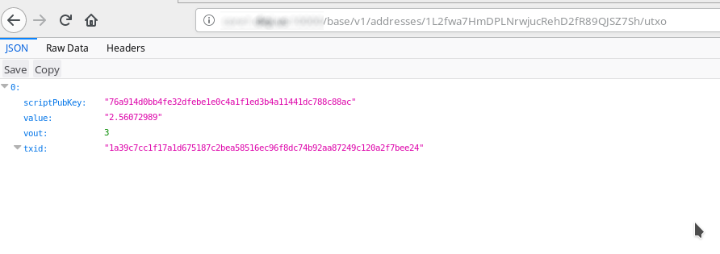

##### 设定转钱给A 1000聪 - 准备
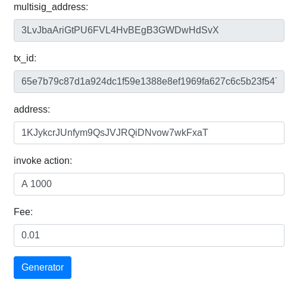

##### 设定转钱给A 1000聪 - 产生结果(Attorney side)
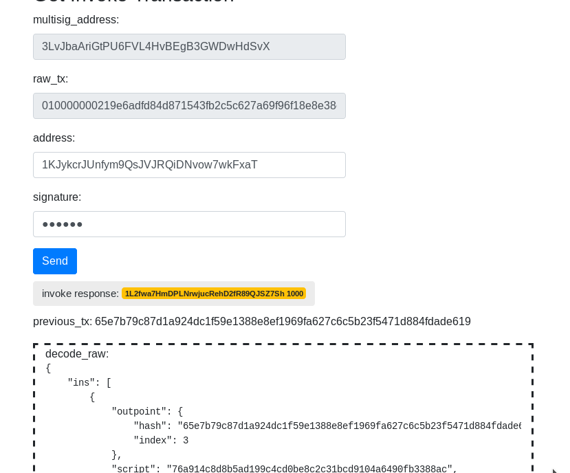

##### 设定转钱给A 1000聪 - 产生结果(Jury 完成确认)
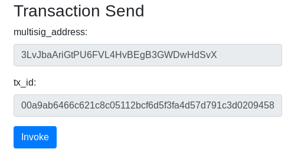

##### 检查A address拥有的Utxo [情境解释与合约执行无关]
* address 获得合约所转的1000聪的Utxo

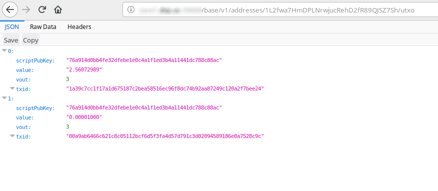
